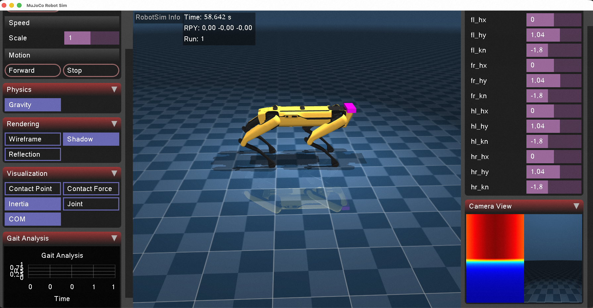

# Robot MuJoCo Simulation



这是一个机器人控制的练习项目，使用MuJoCo作为仿真环境，支持多种机器人模型（如Boston Dynamics Spot和Unitree Go2）的步态控制和交互。

## 功能特性

- **多机器人支持**: 支持Spot和Unitree Go2等机器人模型
- **多种控制方式**:
  - 本地规划器进行步态控制
  - 使用OpenVLA模型进行步态控制
- **传感器集成**: 包括ToF相机、IMU传感器等
- **强化学习环境**: 提供RL训练脚本
- **交互工具**: 通过DDS客户端发送控制指令
- **多种场景**: 支持不同地形和障碍物

## 安装要求

### 系统要求
- macOS (目前主要支持Mac M4，后续会适配Linux)

### 依赖
```bash
# 安装系统依赖
brew install opencv eigen3

# 安装Python依赖
pip install mujoco numpy opencv-python
```

## 构建

```bash
# 创建构建目录
mkdir build
cd build

# 配置CMake
cmake ..

# 构建项目
cmake --build .
```

## 使用方法

### 运行仿真
```bash
./build/RobotSim
```

### 使用控制工具
在另一个终端中运行：
```bash
./build/tools/dds_control_client basic
# 或
./build/tools/dds_control_client raw
```

### 强化学习训练
```bash
cd models/train
python rl_train.py
```

## 项目结构

- `simulate/`: MuJoCo仿真核心代码
- `planner/`: 步态规划器
- `plugins/`: MuJoCo插件
- `robot/`: 机器人模型文件
- `models/`: 包括DrEureka和强化学习环境
- `tools/`: 控制客户端工具
- `src/`: 主要源代码

## TODO

- 给Spot增加IMU传感器，让其参与姿态控制
- 完善传感器模型，设置FOV
- 结合ToF传感器，使用OpenVLA来控制机器人姿态
- 增加多个场景（楼梯、碎石地面、障碍物）
- 让Planner支持多种型号的机器人
- 增加强化学习功能
- 增加一个启动界面，用户可以选择机器人、选择场景、选择不同的控制方式
